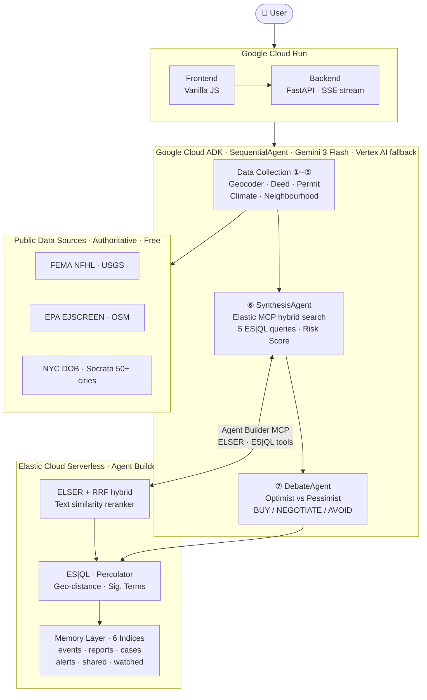

# BLUEPRINT: AI Property Due Diligence

Type any US address. BLUEPRINT reads the public record (deeds, building permits, flood maps, earthquake history, EPA environmental data) and has two AI agents argue the findings before giving you a single sourced verdict.

[](LICENSE)
[](https://github.com/google/adk-python)
[](https://ai.google.dev)
[](https://www.elastic.co)
[](https://fastapi.tiangolo.com)
[](https://blueprint-4foxtttuoa-uc.a.run.app)

Most buyers close on a $500K–$1M home with a 30-minute walkthrough and a seller's disclosure. That disclosure won't mention the 12 open DOB permits, the Superfund site half a mile away, or the fact that the flood zone designation hasn't been updated since 2009. BLUEPRINT surfaces all of it in about 60 seconds.

---

## Architecture



Seven agents run in sequence on Google Cloud ADK. The first five collect data from public APIs. SynthesisAgent uses Elastic Agent Builder MCP (ELSER hybrid search, five ES|QL cross-references) to build the risk score. DebateAgent then runs two opposing Gemini sub-agents (Optimist vs Pessimist) before the verdict reaches the buyer. Every finding persists to Elasticsearch, so the system compounds: each new analysis makes cross-property intelligence richer.

→ [Full architecture walkthrough](docs/architecture.md) · [Why we built it this way](docs/adr/)

---

## The pipeline

| # | Agent | What it actually does |
|---|---|---|
| 1 | GeocoderAgent | Normalises the address, geocodes to lat/lng, identifies county and FEMA flood zone, opens the Elasticsearch case file |
| 2 | DeedAgent | Fetches deed and sale history from public county APIs. Flags price drops >30% in <12 months, rapid flips, and quitclaim deeds in purchase contexts |
| 3 | PermitAgent | Queries 50+ city building permit databases via Socrata. Flags every open/unresolved permit: buyers inherit the liability at closing |
| 4 | ClimateAgent | FEMA National Flood Hazard Layer for zone classification (AE, X, VE, AO), USGS Earthquake Catalog within 75 km |
| 5 | NeighborhoodAgent | EPA EJSCREEN for PM2.5, Superfund proximity, traffic pollution. OSM Overpass for schools, parks, and transit within 500m |
| 6 | SynthesisAgent | ELSER hybrid search + BM25 over all stored events, five ES|QL cross-reference queries, then Gemini produces the Buyer Risk Score, timeline, diligence questions, and Escape Plan |
| 7 | DebateAgent | OptimistAgent argues the score is too high. PessimistAgent argues it's too low. VerdictAgent adjudicates → confidence-adjusted BUY / NEGOTIATE / AVOID |

---

## What you get

- **Buyer Risk Score (0–100)**: composite from 7 data sources, stress-tested by the debate before you see it
- **Escape Plan**: ranked steps to reduce your risk score, each with an estimated point impact
- **Interactive map**: Leaflet with risk-coloured pin, 500m analysis radius, FEMA flood zone overlay
- **Property timeline**: every dated public record (deeds, permits, flood events, earthquakes) in one filterable history, each citing its source
- **Neighbourhood intelligence**: EPA air quality index, Superfund proximity, school/park/transit access
- **Flip-fraud detection**: ES|QL cross-references permit filing dates against deed transfer dates
- **Cross-property intelligence**: similar-risk properties from Elasticsearch's accumulated memory layer
- **Property comparison**: two full pipelines in parallel, head-to-head verdict
- **Share links**: 90-day public report URL, backed by Elasticsearch
- **Watchlist**: properties scoring ≥75 are auto-watched for 24h re-analysis
- **Q&A chat**: ask Gemini follow-up questions about any open report
- **HTML export**: standalone buyer brief with gauge, timeline, debate, and escape plan
- **Slack alerts**: webhook notification when risk score meets a configurable threshold

---

## Stack

| Layer | What's running |
|---|---|
| Agent framework | [Google ADK 2.0](https://github.com/google/adk-python): `SequentialAgent` + `LlmAgent` + `FunctionTool` + `MCPToolset` |
| Primary model | Gemini 3 Flash Preview via AI Studio |
| Fallback model | Gemini 2.5 Flash via Vertex AI (automatic) |
| Search & memory | [Elastic Cloud Serverless](https://cloud.elastic.co): ELSER, Agent Builder MCP, ES|QL, reranker |
| Backend | FastAPI + Uvicorn: async Python, SSE streaming |
| Frontend | Vanilla JS + Leaflet.js: everything rendered from `/api/*`, nothing hardcoded |
| Geocoding | OpenStreetMap Nominatim |
| Permit data | 36 cities with schema-mapped Socrata feeds, 65 portals wired total |
| Climate data | FEMA NFHL, USGS, EPA EJSCREEN: all 50 states |
| Hosting | Google Cloud Run: Docker, scales to zero |

---

## Elasticsearch

Six indices make up the intelligence layer:

| Index | What's in it |
|---|---|
| `blueprint_cases` | One document per address: geocoded location with `geo_point` |
| `blueprint_events` | All property events: permits, deeds, climate, neighbourhood (`semantic_text` for ELSER) |
| `blueprint_reports` | Synthesised reports: risk scores, escape plans, debate verdicts |
| `blueprint_shared` | Share links with 90-day expiry |
| `blueprint_watched` | Watchlist: properties re-analysed every 24 hours |
| `blueprint_alerts` | Percolator queries: saved risk profiles for proactive reverse-search alerting |

Every Elastic capability degrades gracefully to the next-best path. The live state of each is at `/api/elastic/status`, which drives the in-app **Elastic Intelligence** dashboard: nothing is hardcoded in the frontend.

**Retrieval:** ELSER semantic (`semantic_text`, `.elser-2-elasticsearch`) → RRF hybrid (BM25 + ELSER) → `text_similarity_reranker` (`.rerank-v1-elasticsearch`) → BM25 fallback. Every analysis records which path ran.

**ES|QL: five queries per analysis:**
1. Event type distribution with value aggregates
2. Permit-sale timing cross-reference (undisclosed construction detection)
3. High-confidence events filter (confidence ≥ 0.9)
4. Semantic RERANK: top 5 risk events via `.rerank-v1-elasticsearch`
5. Flip-fraud detection: rapid deed transfer pattern

**Beyond search:** `geo_distance` surfaces nearby analysed properties. `significant_terms` identifies risk flags statistically over-represented per band. `terms/stats/percentiles/date_histogram/cardinality` power the market intelligence dashboard at `/api/elastic/insights`. Percolator fires on every finished report.

**Agent Builder MCP:** `platform.core.search` + `platform.core.execute_esql` over Streamable HTTP. Three custom ES|QL tools (`blueprint_flip_fraud`, `blueprint_permit_sale_timing`, `blueprint_top_risk_events`) are provisioned into Agent Builder via the Kibana API at startup, then wired into SynthesisAgent via `MCPToolset`.

---

## Permit coverage

Permit data comes from Socrata open-data portals. 36 cities have fully schema-mapped feeds (real dataset IDs); the rest are wired and fall back gracefully. The live count is at `/api/coverage`.

**Northeast:** New York City, Philadelphia, Baltimore, Washington DC, Boston, Pittsburgh  
**Southeast:** Atlanta, Miami, Tampa, Orlando, Jacksonville, Charlotte, Raleigh, New Orleans, Nashville, Memphis  
**Midwest:** Chicago, Columbus, Cincinnati, Cleveland, Detroit, Indianapolis, Minneapolis, Kansas City, St. Louis  
**South:** Houston, Dallas, San Antonio, Austin, Fort Worth, El Paso  
**West:** Los Angeles, San Diego, San Francisco, San Jose, Sacramento, Oakland, Phoenix, Denver, Las Vegas, Portland, Seattle

All other US addresses still get full climate, flood, earthquake, and environmental analysis via FEMA + USGS + EPA + OSM.

---

## Setup

### What you need

- Python 3.11+
- A [Google Cloud project](https://console.cloud.google.com) with Vertex AI API enabled
- An [Elastic Cloud Serverless account](https://cloud.elastic.co): free trial works fine
- A [Gemini API key](https://aistudio.google.com): paid tier recommended (free tier: 15 req/min)

### Elastic setup

1. [cloud.elastic.co](https://cloud.elastic.co) → create a **Serverless Elasticsearch** project, pick Google Cloud as the region
2. Kibana → **Agent Builder** → enable it (the MCP server starts automatically)
3. **Agent Builder → Tools → MCP** → copy the endpoint URL
4. **Stack Management → API keys** → create a key with `read` + `write` + `manage` on `blueprint_*` indices, plus `monitor_inference` cluster privilege
5. Copy your Elasticsearch URL from the Connection details page

### Configure

```bash
cp .env.example .env
```

```env
GOOGLE_CLOUD_PROJECT=your-gcp-project-id
GOOGLE_CLOUD_REGION=us-central1
GEMINI_API_KEY=your-ai-studio-api-key
GEMINI_MODEL=gemini-3-flash-preview
VERTEX_MODEL=gemini-2.5-flash

ELASTIC_URL=https://your-deployment.es.us-central1.gcp.cloud.es.io
ELASTIC_API_KEY=your_api_key_here
ELASTIC_MCP_URL=https://your-deployment.kb.us-central1.gcp.cloud.es.io/api/agent_builder/mcp

# Optional: leave blank to disable Slack alerts
SLACK_WEBHOOK_URL=https://hooks.slack.com/services/...
SLACK_ALERT_THRESHOLD=60

APP_URL=http://localhost:8080
PORT=8080
```

### Run

```bash
pip install -r requirements.txt
uvicorn backend.main:app --reload --port 8080
```

Open [http://localhost:8080](http://localhost:8080). Good addresses to start with:

- **363 Van Brunt St, Brooklyn, NY**: Sandy flood history, open DOB permits
- **2121 Airline Dr, Houston, TX**: Superfund proximity, hurricane zone, PM2.5
- **2000 E Olympic Blvd, Los Angeles, CA**: Traffic pollution, earthquake zone

```bash
curl http://localhost:8080/api/health
# Should show: "elasticsearch": "connected", "agents": 7
```

If `elastic_mcp` shows `"unavailable (direct SDK fallback)"`, your API key is missing Kibana privileges. The full pipeline still works, it just uses the Elasticsearch Python client directly instead of MCP.

---

## Slack alerts

1. [api.slack.com/apps](https://api.slack.com/apps) → **Create New App** → **Incoming Webhooks** → enable → **Add New Webhook** → pick a channel
2. Copy the webhook URL into `SLACK_WEBHOOK_URL` in `.env`
3. Set `SLACK_ALERT_THRESHOLD` (default 60: alerts fire when the debate-adjusted score meets or exceeds this)

---

## Deploy to Cloud Run

```bash
gcloud auth login && gcloud auth application-default login
gcloud config set project YOUR_PROJECT_ID

# Store secrets
echo -n "your-api-key" | gcloud secrets create GEMINI_API_KEY --data-file=-
echo -n "https://..."  | gcloud secrets create ELASTIC_URL --data-file=-
echo -n "your-key"     | gcloud secrets create ELASTIC_API_KEY --data-file=-
echo -n "https://..."  | gcloud secrets create ELASTIC_MCP_URL --data-file=-

./deploy.sh
```

Cloud Build packages it, Cloud Run deploys it (2 vCPU / 2 GiB, scales to zero). The script prints the live URL: set that as `APP_URL` in your environment for correct share link generation.

---

## API

| Method | Path | What it does |
|---|---|---|
| `GET` | `/api/analyze/stream` | SSE real-time streaming analysis |
| `POST` | `/api/analyze` | One-shot JSON analysis |
| `POST` | `/api/compare` | Two properties, parallel pipelines |
| `POST` | `/api/ask` | Q&A about a stored report |
| `GET` | `/api/report/{hash}` | Retrieve stored report |
| `GET` | `/api/export/{hash}` | Download standalone HTML brief |
| `POST` | `/api/share/{hash}` | Create share link (90-day expiry) |
| `GET` | `/api/share/{share_id}` | Open shared report |
| `POST/GET/DELETE` | `/api/watch` | Watchlist management |
| `GET` | `/api/similar/{hash}` | Similar-risk properties from memory layer |
| `GET` | `/api/elastic/status` | Live Elastic capability matrix |
| `GET` | `/api/elastic/insights` | Cross-property market aggregations |
| `GET` | `/api/coverage` | Permit cities + nationwide sources |
| `GET` | `/api/health` | Service health |
| `GET` | `/api/about` | Methodology, glossary, agent descriptions |
| `GET` | `/api/stats` | Platform statistics |

Swagger at `/docs`, ReDoc at `/redoc`.

---

## Project layout

```
blueprint/
├── backend/
│   ├── main.py                  # FastAPI app, health/about/stats/similar/elastic endpoints
│   ├── config.py                # All config from environment variables
│   ├── routes/
│   │   ├── analyze.py           # /api/analyze, SSE stream, Q&A, recent
│   │   ├── compare.py           # Parallel dual-pipeline comparison
│   │   ├── export.py            # Gemini-generated HTML buyer brief
│   │   ├── share.py             # Share links with expiry
│   │   └── watch.py             # Watchlist CRUD + 24h background re-analysis
│   └── services/
│       ├── adk_runner.py        # 7-agent ADK pipeline + SSE queue
│       ├── elastic_client.py    # Elasticsearch + Agent Builder MCP, ELSER, ES|QL
│       ├── gemini.py            # Gemini + Vertex AI fallback
│       ├── geocoder.py          # Nominatim
│       ├── data_fetchers.py     # FEMA, USGS, EPA, OSM, Socrata 65+ cities
│       └── slack.py             # Slack webhook alerts
├── frontend/
│   ├── index.html               # Landing page
│   ├── app.html                 # Analysis app
│   ├── app.js                   # SSE client, gauge, map, report rendering
│   ├── style.css                # Dark/light theme, responsive
│   ├── landing.js               # Landing page JS
│   └── landing.css              # Landing page styles
├── docs/
│   ├── architecture.md          # Full system architecture + data flow
│   └── adr/                     # Architecture decision records
├── tests/                       # 86+ fast tests + full pipeline slow tests
├── Dockerfile
├── deploy.sh                    # Cloud Build + Cloud Run
├── requirements.txt
└── .env.example
```

---

## A few caveats

NYC and Austin have the most complete permit histories. Other cities use the Socrata generic schema, which varies in quality. Addresses outside the 65 covered cities still get full climate and environmental analysis.

The Gemini free tier caps at 15 requests/minute. The pipeline makes several model calls per analysis, so a paid AI Studio key is worth it for anything beyond casual use.

BLUEPRINT is informational. The data comes from public records and automated analysis: not licensed professionals. Verify anything that matters before signing.

---

## License

Apache 2.0: see [LICENSE](LICENSE)
