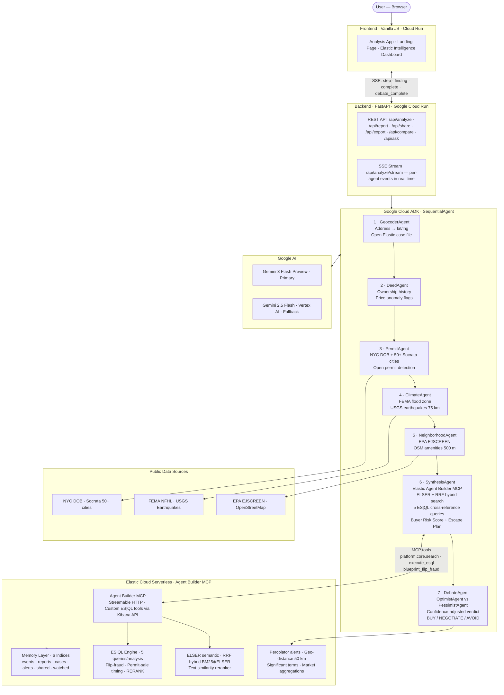

# BLUEPRINT — AI Property Due Diligence

> *A 7-agent adversarial AI pipeline that turns scattered public records into a sourced Buyer Risk Score — complete with a live OptimistAgent vs PessimistAgent debate before every verdict.*

**BLUEPRINT** answers the question every homebuyer should ask but rarely gets a straight answer to: *"What am I actually buying?"*

Type any US address. BLUEPRINT's pipeline retrieves deed history, building permits, flood zone data, earthquake exposure, environmental hazards, and neighbourhood intelligence — cross-references everything via Elasticsearch hybrid search and ES|QL — then runs an adversarial AI debate to deliver a confidence-adjusted **BUY / NEGOTIATE / AVOID** verdict and a ranked **Escape Plan** for risk reduction.

[](LICENSE)
[](https://github.com/google/adk-python)
[](https://ai.google.dev)
[](https://www.elastic.co)
[](https://fastapi.tiangolo.com)

---

## Architecture



> Full architecture details, data flow walkthrough, and Elastic capability map: **[docs/architecture.md](docs/architecture.md)**  
> Key architectural decisions: **[docs/adr/](docs/adr/)**

### Technology

| Capability | How BLUEPRINT delivers it |
|---|---|
| **Powered by Gemini** | Gemini 3 Flash Preview drives synthesis, the adversarial debate, comparison, and Q&A — with automatic Vertex AI (Gemini 2.5 Flash) fallback |
| **Google Cloud Agent Builder** | Built on Google's **Agent Development Kit (ADK 2.0)** — the open-source framework behind Vertex AI Agent Builder / Agent Engine — orchestrating a 7-agent `SequentialAgent`; deploys to Google Cloud Run |
| **Partner MCP integration** | **Elastic Agent Builder MCP** (Streamable HTTP) for hybrid search + ES\|QL, plus custom ES\|QL tools provisioned into Agent Builder via the Kibana API |
| **Only Google + partner AI** | Gemini (Google) for generation; Elastic's built-in AI (ELSER, `.rerank-v1-elasticsearch`) for retrieval. No third-party AI |
| **Web platform, public repo, OSI license** | FastAPI + vanilla-JS SPA on Cloud Run; Apache 2.0 |

---

## What it does

A buyer types any US residential address. BLUEPRINT's 7-agent Google ADK pipeline runs in sequence, streaming live progress to the browser via Server-Sent Events:

| # | Agent | What it does |
|---|---|---|
| 1 | **GeocoderAgent** | Normalises the address, geocodes to lat/lng, identifies county and state, creates the Elasticsearch case file |
| 2 | **DeedAgent** | Fetches deed and sale history from public county APIs. Flags price drops >30%, rapid flips, and quitclaim deeds |
| 3 | **PermitAgent** | Queries city building permit databases via Socrata open-data portals. Flags every open/unresolved permit — buyers inherit the liability |
| 4 | **ClimateAgent** | Checks FEMA National Flood Hazard Layer (flood zones AE/X) and USGS Earthquake Catalog within 75 km |
| 5 | **NeighborhoodAgent** | Queries EPA EJSCREEN (PM2.5, Superfund proximity, traffic pollution) and OSM Overpass (schools, parks, transit within 500m) |
| 6 | **SynthesisAgent** | Hybrid ELSER semantic + BM25 search over all Elasticsearch events + five ES|QL queries → Gemini 3 generates the Buyer Risk Score, property timeline, diligence questions, and Escape Plan |
| 7 | **DebateAgent** | OptimistAgent argues the score is too high. PessimistAgent argues it's too low. VerdictAgent adjudicates → confidence-adjusted BUY / NEGOTIATE / AVOID |

---

## Features

- **Live 7-agent pipeline** with real-time SSE streaming — watch each agent's progress as it runs
- **Adversarial AI debate** — OptimistAgent vs PessimistAgent → confidence-adjusted final verdict
- **Buyer Risk Score (0–100)** — composite score from 7 data sources, stress-tested before delivery
- **Animated SVG gauge** — score animates from 0 to final value with an easeOutCubic curve; re-animates when the debate updates it
- **Escape Plan** — ranked, actionable steps to lower your risk score before or after purchase
- **Interactive property map** — Leaflet.js map with risk-colored pin, 500m analysis radius, and FEMA flood zone overlay
- **Neighbourhood Intelligence** — EPA air quality index, Superfund proximity score, school/park/transit access
- **Property Timeline** — chronological deed/permit/climate event history with source citations, filterable by type
- **Flip fraud detection** — ES|QL detects ≥3 deed transfers on the same property (rapid flip pattern)
- **ES|QL semantic reranking** — top-risk events surfaced via `.rerank-v1-elasticsearch` before Gemini synthesis
- **Auto-watch** — properties scoring ≥75 are automatically added to the watchlist for 24h monitoring
- **Cross-property intelligence** — `/api/similar/{hash}` queries the Elasticsearch memory layer for other analysed properties with the same risk profile
- **Property comparison** — run two full 7-agent pipelines in parallel, get a head-to-head "which should I buy?" verdict
- **Share links** — generate a shareable report URL (90-day expiry, Elasticsearch-backed)
- **Watchlist** — manually or automatically monitor properties; re-analysed every 24 hours
- **Q&A chat** — ask Gemini 3 follow-up questions about any open report
- **HTML export** — professional standalone buyer brief with gauge, timeline, debate results, and escape plan
- **Slack alerts** — automatic webhook notification when risk score ≥ configurable threshold
- **Dark/light theme** — persisted in localStorage

---

## Tech stack

| Layer | Technology |
|---|---|
| **Agent framework** | [Google Agent Development Kit (ADK) 2.0](https://github.com/google/adk-python) — the open-source framework that powers **Vertex AI Agent Builder / Agent Engine**. Uses `SequentialAgent` + `LlmAgent` + `FunctionTool` + `Runner` |
| **Primary model** | Gemini 3 Flash Preview (`gemini-3-flash-preview`) via AI Studio API |
| **Fallback model** | Gemini 2.5 Flash via Vertex AI — automatic if primary is unavailable |
| **Search & memory** | [Elastic Cloud Serverless](https://cloud.elastic.co) — ELSER hybrid retrieval, Agent Builder MCP, ES|QL, `text_similarity_reranker` |
| **Backend** | FastAPI + Uvicorn — async Python, SSE streaming, 18 REST endpoints |
| **Frontend** | Vanilla JS + Leaflet.js — single-page app, all data from `/api/*` endpoints |
| **Geocoding** | OpenStreetMap Nominatim — no API key required |
| **Permit data** | 36 cities with schema-mapped Socrata permit feeds, 65 portals wired total (graceful fallback) |
| **Climate data** | FEMA NFHL, USGS Earthquake Catalog, EPA EJSCREEN — all 50 states |
| **Neighbourhood** | OSM Overpass API — schools, parks, transit, amenities within 500m |
| **Alerts** | Slack Incoming Webhooks |
| **Hosting** | Google Cloud Run — Docker, 2 vCPU / 2 GiB, scales to zero |

---

## Elasticsearch integration

BLUEPRINT uses six Elasticsearch indices as a persistent intelligence layer:

| Index | Purpose |
|---|---|
| `blueprint_cases` | Geocoded property case files — one document per address analysed (`geo_point` location) |
| `blueprint_events` | Property events — permits, deeds, climate, neighbourhood findings (`semantic_text` field for ELSER) |
| `blueprint_reports` | Synthesised reports — risk scores, escape plans, debate verdicts (`geo_point`, permanently searchable) |
| `blueprint_shared` | Share links — public report access with expiry timestamps |
| `blueprint_watched` | Watchlist — monitored properties re-analysed every 24 hours |
| `blueprint_alerts` | Percolator — saved risk-profile queries for proactive reverse-search alerting |

BLUEPRINT deliberately exercises the **full Elastic Search-AI surface** — every capability
degrades gracefully to the next-best path, and the live state of each is exposed at
`/api/elastic/status` (rendered in the in-app **⚡ Elastic Intelligence** dashboard, nothing hardcoded).

**Retrieval**

- **ELSER semantic search** — `semantic_text` over heterogeneous property records via `.elser-2-elasticsearch`
- **RRF hybrid retriever** — Reciprocal Rank Fusion blends BM25 lexical + ELSER semantic rankings
- **`text_similarity_reranker`** — `.rerank-v1-elasticsearch` reorders results by risk relevance; graceful BM25 fallback
- Every analysis records which strategy actually ran (shown in the report's "How Elastic powered this analysis" panel)

**Analytics**

- **ES|QL** — five cross-reference queries per analysis:
  1. Event type distribution with value aggregates
  2. Permit-sale timing cross-reference (undisclosed construction detection)
  3. High-confidence events filter (confidence ≥ 0.9)
  4. Semantic RERANK — top 5 risk events via `.rerank-v1-elasticsearch`
  5. Flip-fraud detection — rapid deed transfer pattern (≥2 sales, flagged at ≥3)
- **Geo-distance** — `geo_point` + `geo_distance` surface previously-analysed properties within 50 km, nearest first
- **Aggregations** — `terms` · `stats` · `percentiles` · `date_histogram` · `cardinality` power live market intelligence (`/api/elastic/insights`)
- **`significant_terms`** — risk flags statistically over-represented in each risk band

**Agentic & proactive**

- **Agent Builder MCP** — Streamable HTTP at `{KIBANA_URL}/api/agent_builder/mcp`; `platform.core.search` + `platform.core.esql`
- **Custom Agent Builder tools** — BLUEPRINT provisions ES|QL tools (`blueprint_flip_fraud`, `blueprint_permit_sale_timing`, `blueprint_top_risk_events`) into Agent Builder via the Kibana API, then **wires them into the ADK SynthesisAgent via `MCPToolset`** — so Gemini *autonomously chooses* to call them by name over MCP, not hard-coded Python
- **Percolator** — saved risk-profile queries; every finished report is reverse-searched to fire proactive risk alerts
- **Memory-layer write-back** — every agent writes findings to Elasticsearch before the next reads them; synthesised reports accumulate permanently and power the geo + aggregation cross-property intelligence

---

## Permit coverage

Building-permit data is pulled from Socrata open-data portals. **36 cities** have fully
schema-mapped permit feeds (real Socrata dataset IDs); the remainder are wired to their
city portals and fall back gracefully when a feed is unavailable. The live, authoritative
count is exposed at `/api/coverage` (`verified_permit_cities` vs `total_permit_cities`) —
the UI reads it from there, nothing is hardcoded. Schema-mapped + wired cities:

**Northeast:** New York City, Philadelphia, Baltimore, Washington DC, Boston, Newark, Hartford, Providence, Pittsburgh  
**Southeast:** Atlanta, Miami, Tampa, Orlando, Jacksonville, Charlotte, Raleigh, Richmond, Virginia Beach, New Orleans, Memphis, Nashville  
**Midwest:** Chicago, Columbus, Cincinnati, Cleveland, Detroit, Indianapolis, Milwaukee, Minneapolis, Kansas City, St. Louis, Omaha, Wichita, Des Moines  
**South:** Houston, Dallas, San Antonio, Austin, Fort Worth, El Paso, Lubbock, Oklahoma City  
**West:** Los Angeles, San Diego, San Francisco, San Jose, Sacramento, Oakland, Fresno, Long Beach, Phoenix, Tucson, Mesa, Denver, Colorado Springs, Las Vegas, Portland, Seattle, Spokane, Albuquerque, Louisville, Honolulu, Anchorage  
**Other:** Columbia SC, Manchester NH

All other US addresses still receive full climate, flood, earthquake, and environmental intelligence via FEMA + USGS + EPA + OSM.

---

## Local setup

### Prerequisites

- Python 3.11+
- [Google Cloud project](https://console.cloud.google.com) with Vertex AI API enabled
- [Elastic Cloud Serverless account](https://cloud.elastic.co) (free trial available)
- [Gemini API key](https://aistudio.google.com) (paid tier recommended — free tier: 15 req/min)

### 1. Elastic Cloud setup

1. Go to [cloud.elastic.co](https://cloud.elastic.co) → **Start free trial**
2. Create a **Serverless Elasticsearch** project → choose Google Cloud as cloud provider
3. Open Kibana → navigate to **Agent Builder** (Search or Management section)
4. Enable Agent Builder — the built-in MCP server starts automatically
5. Go to **Agent Builder → Tools → MCP** → copy the MCP endpoint URL
6. Go to **Stack Management → API keys** → create a key with `read` + `write` + `manage` index privileges on `blueprint_*`, plus `monitor_inference` cluster privilege
7. Copy your **Elasticsearch URL** from the Connection details page

### 2. Configure environment

```bash
cd blueprint
cp .env.example .env
```

Edit `.env`:

```env
# Google Cloud
GOOGLE_CLOUD_PROJECT=your-gcp-project-id
GOOGLE_CLOUD_REGION=us-central1
GEMINI_API_KEY=your-ai-studio-api-key
GEMINI_MODEL=gemini-3-flash-preview
VERTEX_MODEL=gemini-2.5-flash

# Elastic
ELASTIC_URL=https://your-deployment.es.us-central1.gcp.cloud.es.io
ELASTIC_API_KEY=your_api_key_here
ELASTIC_MCP_URL=https://your-deployment.kb.us-central1.gcp.cloud.es.io/api/agent_builder/mcp

# Slack alerts (optional — leave blank to disable)
SLACK_WEBHOOK_URL=https://hooks.slack.com/services/T.../B.../...
SLACK_ALERT_THRESHOLD=60

# App
APP_URL=http://localhost:8080
PORT=8080
```

### 3. Install and run

```bash
pip install -r requirements.txt
uvicorn backend.main:app --reload --port 8080
```

Open [http://localhost:8080](http://localhost:8080)

Try the demo addresses:
- **363 Van Brunt St, Brooklyn, NY** — Flood Zone AE (Sandy damage history), open DOB permits
- **2121 Airline Dr, Houston, TX** — Superfund proximity, hurricane zone, high PM2.5
- **2000 E Olympic Blvd, Los Angeles, CA** — Traffic pollution, earthquake zone, unpermitted additions

### 4. Verify

```bash
curl http://localhost:8080/api/health
```

Expected response includes `"elasticsearch": "connected"`, `"agents": 7`, `"gemini_model": "gemini-3-flash-preview"`.

`elastic_mcp` may show `"unavailable (direct SDK fallback)"` if your API key lacks Kibana privileges — the full pipeline still works using the Elasticsearch Python client directly.

---

## Slack alerts

1. Go to [api.slack.com/apps](https://api.slack.com/apps) → **Create New App** → **From Scratch**
2. Name it anything (e.g. `BLUEPRINT Alerts`) → select your workspace → **Create App**
3. Left sidebar: **Incoming Webhooks** → toggle ON → **Add New Webhook to Workspace**
4. Pick a channel (e.g. `#property-alerts`) → **Allow**
5. Copy the webhook URL (`https://hooks.slack.com/services/...`)
6. Set `SLACK_WEBHOOK_URL` and `SLACK_ALERT_THRESHOLD` in `.env`
7. Restart the server — every analysis where the score meets or exceeds the threshold posts a formatted alert

---

## Deploy to Google Cloud Run

```bash
# One-time setup
gcloud auth login
gcloud auth application-default login
gcloud config set project YOUR_PROJECT_ID

# Store secrets in Secret Manager
echo -n "your-api-key" | gcloud secrets create GEMINI_API_KEY --data-file=-
echo -n "https://..."  | gcloud secrets create ELASTIC_URL --data-file=-
echo -n "your-key"     | gcloud secrets create ELASTIC_API_KEY --data-file=-
echo -n "https://..."  | gcloud secrets create ELASTIC_MCP_URL --data-file=-

# Deploy
chmod +x deploy.sh
./deploy.sh
```

The script builds via Cloud Build, deploys to Cloud Run (2 vCPU / 2 GiB, scales to zero), and prints the live URL. Set that URL as `APP_URL` in `.env` for correct Slack alert links.

---

## API reference

| Method | Path | Description |
|---|---|---|
| `GET` | `/api/analyze/stream` | SSE real-time streaming analysis |
| `POST` | `/api/analyze` | One-shot JSON analysis (full 7-agent pipeline) |
| `POST` | `/api/compare` | Compare two properties in parallel |
| `POST` | `/api/ask` | Q&A chat about a stored report |
| `GET` | `/api/report/{hash}` | Retrieve stored report from Elasticsearch |
| `GET` | `/api/export/{hash}` | Download standalone HTML buyer brief |
| `POST` | `/api/share/{hash}` | Create shareable link (90-day expiry) |
| `GET` | `/api/share/{share_id}` | Retrieve report via share link |
| `POST` | `/api/watch` | Add property to watchlist |
| `GET` | `/api/watch` | List watched properties |
| `DELETE` | `/api/watch/{hash}` | Remove from watchlist |
| `GET` | `/api/similar/{hash}` | Similar-risk properties from Elasticsearch memory layer |
| `GET` | `/api/elastic/status` | Live Elastic index counts, MCP tools, and capability flags |
| `GET` | `/api/coverage` | All cities with permit data + nationwide climate sources |
| `GET` | `/api/health` | Service health and configuration |
| `GET` | `/api/about` | Educational content — methodology, glossary, agent descriptions |
| `GET` | `/api/stats` | Live platform statistics |
| `GET` | `/api/recent` | Recent analyses |

Interactive API docs at `/docs` (Swagger) and `/redoc`.

---

## Data sources

| Source | Data | Coverage |
|---|---|---|
| OpenStreetMap Nominatim | Address geocoding | Worldwide |
| OSM Overpass API | Schools, parks, transit, amenities | Worldwide |
| NYC Open Data — DOB Permits & Sales | Building permits + rolling property sales | New York City (5 boroughs) |
| Socrata city portals | Building permits | 36 schema-mapped cities, 65 wired |
| FEMA National Flood Hazard Layer | Flood zone classification (AE, X, VE, AO, etc.) | All 50 states + territories |
| USGS Earthquake Catalog | Seismic events within 75 km (M2.5+) | Worldwide |
| EPA EJSCREEN | PM2.5, Superfund proximity, traffic pollution, diesel PM | All 50 states (block-group level) |

All sources are public domain or openly licensed. No personally identifiable information about property occupants is collected or stored.

---

## Project structure

```
blueprint/
├── backend/
│   ├── config.py                # All settings loaded from environment variables
│   ├── main.py                  # FastAPI app, lifespan, health/about/stats/similar/elastic-status
│   ├── routes/
│   │   ├── analyze.py           # /api/analyze, /api/analyze/stream (SSE), /api/ask, /api/recent
│   │   ├── compare.py           # /api/compare — parallel dual-pipeline comparison
│   │   ├── export.py            # /api/export — Gemini-generated standalone HTML report
│   │   ├── share.py             # /api/share — shareable links with 90-day expiry
│   │   └── watch.py             # /api/watch — watchlist CRUD + 24h background re-analysis
│   └── services/
│       ├── adk_runner.py        # 7-agent ADK SequentialAgent pipeline + SSE queue
│       ├── elastic_client.py    # Elasticsearch SDK + Agent Builder MCP, ELSER, ES|QL, reranking
│       ├── gemini.py            # Gemini 3 Flash + Vertex AI fallback
│       ├── geocoder.py          # Nominatim geocoding
│       ├── data_fetchers.py     # NYC, 65+ Socrata cities, FEMA, USGS, EPA, OSM Overpass
│       └── slack.py             # Slack Incoming Webhook alerts
├── frontend/
│   ├── index.html               # Single-page app — zero hardcoded data, everything from /api/*
│   ├── style.css                # Dark/light theme, mobile-responsive, Leaflet overrides
│   └── app.js                   # SSE client, animated gauge, Leaflet map, all report rendering
├── tests/
│   ├── conftest.py              # Shared fixtures
│   ├── test_health.py           # /api/health, /api/about, /api/stats
│   ├── test_analyze.py          # Full pipeline, SSE streaming, share, export, Q&A
│   ├── test_compare.py          # Parallel comparison
│   ├── test_watch.py            # Watchlist CRUD
│   └── test_validate.py         # Input validation (422/400/404)
├── Dockerfile                   # Python 3.11-slim, Cloud Run ready
├── deploy.sh                    # Cloud Build + Cloud Run deploy script
├── requirements.txt
├── .env.example                 # Environment variable template
└── LICENSE                      # Apache 2.0
```

---

## Caveats

- **Permit coverage** — NYC (5 boroughs) and Austin have the most detailed permit history; other cities use the Socrata generic schema. Addresses outside the 65 covered cities still receive full climate and environmental analysis.
- **Gemini free tier** — 15 requests/minute; the 7-agent pipeline makes several model calls per analysis. A paid AI Studio key is recommended for sustained use.
- **Elastic MCP** — requires a Kibana API key with `feature_agentBuilder.read` privilege. If unavailable, the pipeline falls back to the Elasticsearch Python client with identical functionality.
- **Not professional advice** — BLUEPRINT provides property intelligence for informational purposes. Always consult licensed professionals before making purchasing decisions.

---

## License

Apache 2.0 — see [LICENSE](LICENSE)
