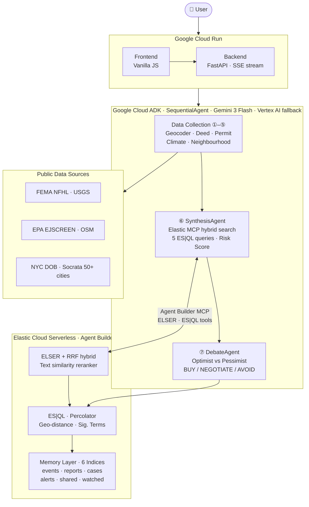

# BLUEPRINT: System Architecture

## How it works

You type a US address. BLUEPRINT sends it through a pipeline of seven AI agents, each focused on one job. The first five go out to public databases and collect everything on record: permit filings, ownership history, flood maps, earthquake data, environmental hazards. The sixth agent searches all of that through Elasticsearch and builds the risk score. The seventh agent has two opposing AI models argue the score before you ever see it.

Every finding gets written to Elasticsearch as the pipeline runs. That means the system gets more useful over time. After enough analyses, it can tell you what other properties with the same risk profile look like, which risk flags are statistically common in each risk band, and whether this property is in the top percentile for buyer risk in its region.

---

## Diagram

---

## What each layer does

**Google Cloud Run** hosts both the frontend (the website) and the backend API. The backend streams live updates to the browser as each agent completes its work, so you watch the pipeline run in real time rather than waiting for a spinner to finish.

**Google Cloud ADK** is the agent framework. The seven agents run in sequence, each writing its findings to Elasticsearch before the next one starts. They share state through a session object, not function arguments, so a downstream agent can see everything upstream agents found without re-calling any APIs.

**Elastic Cloud Serverless** is the intelligence layer. SynthesisAgent does not just do a keyword search. It uses ELSER (Elastic's sparse-vector semantic search model) combined with BM25 in a hybrid RRF retriever, then reranks results by risk relevance using the `.rerank-v1-elasticsearch` model. Five ES|QL queries cross-reference the retrieved events: detecting permit-to-sale timing anomalies, surfacing the highest-confidence events, and running flip-fraud detection. After synthesis, the percolator reverse-searches the finished report against saved risk profiles and fires alerts if it matches. Geo-distance queries find comparable properties within 50 km. Significant-terms aggregations identify statistically unusual risk flags for the report's risk band.

**Public data sources** are all free and authoritative: FEMA for flood zones, USGS for earthquakes, EPA EJSCREEN for environmental indicators, OpenStreetMap for local amenities, and Socrata open-data portals for building permits across 50+ US cities.

---

## A real example

Here is what happens when you type "363 Van Brunt St, Brooklyn, NY":

1. GeocoderAgent normalises the address, geocodes it to (40.6776, -74.0128), identifies Kings County, and opens an Elasticsearch case file
2. DeedAgent queries NYC Socrata for sale history. No anomalies found.
3. PermitAgent queries NYC DOB. Finds 30 open permits, writes 18 to Elasticsearch, flags a warning
4. ClimateAgent queries FEMA NFHL. Returns flood zone. Queries USGS within 75 km.
5. NeighborhoodAgent queries EPA EJSCREEN for air quality and Superfund proximity. Queries OSM for schools, parks, and transit stops within 500m.
6. SynthesisAgent searches Elasticsearch via Agent Builder MCP, runs 5 ES|QL queries, calls Gemini: initial score 68, risk level HIGH
7. DebateAgent runs two sub-agents. OptimistAgent argues 34 (paperwork issue, good location). PessimistAgent argues 89 (30 permits could invalidate Certificate of Occupancy). VerdictAgent settles at 75, confidence HIGH, verdict NEGOTIATE
8. The percolator matches one saved profile: "Elevated risk band". The property is auto-added to the watchlist.
9. The browser receives the `debate_complete` SSE event and updates the verdict banner to 75/100 HIGH.

---

## Elasticsearch in detail

Every Elastic capability used in BLUEPRINT is live and observable at `/api/elastic/status`. None of it is hardcoded.

| Elastic feature | What it does in BLUEPRINT | Where you see it |
|---|---|---|
| ELSER sparse-vector search | Semantic retrieval over property events without requiring exact keyword matches | Retrieval strategy in report provenance |
| RRF hybrid (BM25 + ELSER) | Blends exact-match and semantic rankings for best-of-both retrieval | "RRF hybrid" label in report |
| Text similarity reranker | Reorders retrieved events by risk relevance before synthesis | ES|QL RERANK row count in report |
| ES|QL (5 queries per analysis) | Cross-references events: permit timing, flip-fraud, high-confidence filter, RERANK, distribution | Expandable query list in report |
| geo_distance | Finds other analysed properties within 50 km | "Similar risk profiles" section |
| Percolator | Reverse-searches finished reports against saved risk profiles | Alert chips in report |
| significant_terms | Identifies risk flags statistically over-represented in each risk band | Elastic Intelligence dashboard |
| Aggregations | Market intelligence: score percentiles, flag distribution, analyses over time | Elastic Intelligence dashboard |
| Memory write-back | Every agent finding persists and becomes searchable context | Property count, cross-property intelligence |
| Agent Builder MCP | Gemini agents call Elastic search and ES|QL tools over Streamable HTTP | "Elastic MCP" badge in header |
| Custom ES|QL tools | Three tools provisioned via Kibana API, wired into SynthesisAgent via MCPToolset | "Agent Builder custom tools" capability |

---

## Why we made the decisions we did

See [docs/adr/](adr/) for the reasoning behind the four most consequential design choices:

- [ADR-0001](adr/0001-adversarial-debate-architecture.md): Why adversarial debate instead of a single synthesis call
- [ADR-0002](adr/0002-elastic-as-intelligence-layer.md): Why Elastic instead of a standalone vector database
- [ADR-0003](adr/0003-specialised-agent-pipeline.md): Why seven specialised agents instead of one general agent
- [ADR-0004](adr/0004-sse-streaming-over-polling.md): Why SSE streaming instead of polling
