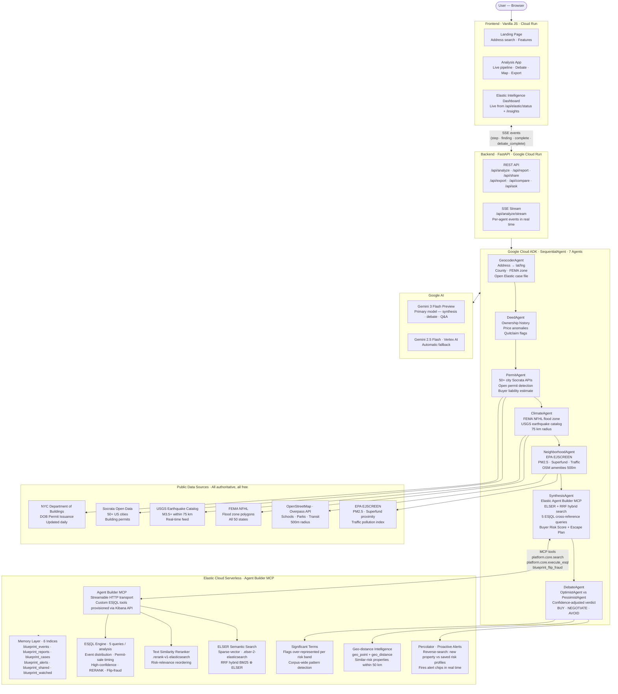

# BLUEPRINT — System Architecture

## Overview (15-second pitch)

> A user enters any US address. Five specialist agents fetch public records in parallel — permits from 50+ city databases, flood zones from FEMA, earthquakes from USGS, environmental hazards from EPA. SynthesisAgent uses Elastic Agent Builder MCP to run ELSER hybrid search and 5 ES|QL cross-reference queries across everything stored. DebateAgent then runs OptimistAgent vs PessimistAgent to stress-test the score before the buyer sees it. Every finding persists to Elasticsearch — building a compounding memory layer that makes each new analysis smarter.

---

## Architecture Diagram



---

## Data Flow — One Analysis

```
1. User types "363 Van Brunt St, Brooklyn, NY"
2. Browser opens SSE connection → /api/analyze/stream
3. GeocoderAgent   → geocodes to (40.6776, −74.0128), Kings County, NY; opens Elastic case file
4. DeedAgent       → queries NYC Socrata for deed/sale records; writes events to blueprint_events
5. PermitAgent     → queries NYC DOB; finds 30 open permits; writes 18 to blueprint_events; emits [WARN]
6. ClimateAgent    → queries FEMA NFHL at (lng, lat); queries USGS; writes climate events
7. NeighborhoodAgent → queries EPA EJSCREEN; queries OSM Overpass API; writes neighborhood events
8. SynthesisAgent  → calls Elastic Agent Builder MCP → hybrid ELSER+BM25 search (9 events retrieved)
                   → runs 5 ES|QL queries (distribution, timing, confidence, RERANK, flip-fraud)
                   → calls Gemini: produces score=68, risk_level=HIGH, timeline, escape plan
9. DebateAgent     → OptimistAgent argues score=34; PessimistAgent argues score=89
                   → VerdictAgent adjudicates: final_score=75, confidence=HIGH
                   → percolates property → 1 alert match ("Elevated risk band")
                   → auto-adds to watchlist (score ≥ 75)
                   → writes debate + updated score back to blueprint_reports
10. SSE sends `debate_complete` → browser updates verdict banner: 75/100 HIGH NEGOTIATE
```

---

## Elastic Capability Map

| Elastic Feature | Where Used | Visible in UI |
|---|---|---|
| ELSER sparse-vector (`semantic_text`) | SynthesisAgent hybrid search | Retrieval strategy badge |
| BM25 keyword retrieval | Hybrid fallback | Retrieval strategy badge |
| RRF (BM25 ⊕ ELSER) | Primary retrieval strategy | "RRF hybrid" in provenance |
| `text_similarity_reranker` | Post-retrieval reranking | ES|QL RERANK query row count |
| ES|QL (5 queries) | Cross-reference, flip-fraud, distribution | Expandable query list in report |
| `geo_point` + `geo_distance` | Similar property lookup | "Similar risk profiles" section |
| Percolator reverse-search | Proactive risk alerts | Alert chips at top of report |
| `significant_terms` | Risk-flag pattern detection | Elastic Intelligence dashboard |
| Aggregations (terms/stats/percentile/histogram/cardinality) | Market intelligence | Elastic Intelligence dashboard |
| Memory write-back | All agent findings persisted | Property count, cross-property intelligence |
| Agent Builder MCP | SynthesisAgent tool calls | "Elastic MCP ✓" badge |
| Custom ES|QL tools (Kibana) | blueprint_flip_fraud etc. | "Agent Builder custom tools" capability |

---

## ADRs

Key architectural decisions are documented in `/docs/adr/`:

- [ADR-0001](adr/0001-adversarial-debate-architecture.md) — Why adversarial debate instead of single-pass synthesis
- [ADR-0002](adr/0002-elastic-as-intelligence-layer.md) — Why Elastic as the intelligence layer, not a vector DB
- [ADR-0003](adr/0003-specialised-agent-pipeline.md) — Why 7 specialised agents over one general agent
- [ADR-0004](adr/0004-sse-streaming-over-polling.md) — Why SSE streaming over polling or WebSocket
